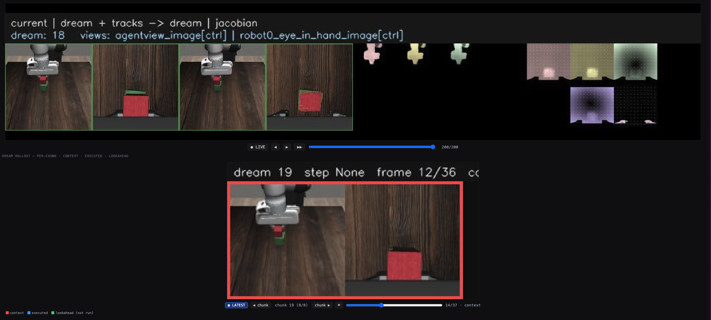

<h1 align="center">Turning Video Models into Generalist Robot Policies</h1>

<p align="center">
  Sizhe Lester Li<sup>*</sup>,
  Evan Kim<sup>*</sup>,
  Xingjian Bai<sup>*</sup>
</p>
<p align="center">
  Tong Zhao,
  Tao Pang,
  Max Simchowitz,
  Vincent Sitzmann
</p>

<p align="center"><sup>*</sup>equal contribution</p>

<p align="center">
  <a href="https://arxiv.org/abs/2605.27817">[Paper]</a> &nbsp;·&nbsp;
  <a href="https://vera.csail.mit.edu/">[Project Page]</a> &nbsp;·&nbsp;
  <a href="https://huggingface.co/sizhe-lester-li/VERA">[Models &amp; Data]</a>
</p>

https://github.com/user-attachments/assets/4d5d7325-43df-43e8-ae25-222e3b2c5417

**VERA** (**V**ideo-to-**E**mbodied **R**obot **A**ction model) is a **two-stage**, closed-loop
video-to-action policy. It leaves a video generative model **as-is** as an action-free world model that
"dreams" the future, and trains an embodiment-specific **inverse-dynamics model (IDM)** — built on the
robot's **Jacobian** — to translate that dream into actions:

1. **Video planner** (`vera.video_model` / `vera.idm.dfot`)
2. **Jacobian IDM** (`vera.idm` + `vera.policy`)

**Start here:** [Install](#install) → [Run VERA](#run-vera) (each task is one server command + one
notebook). To see the planner alone — no simulator, no robot — jump straight to the
[DROID generation walkthrough](#droid-video-generation-from-language-no-sim-no-robot).

---

<a id="news"></a>
## 🔥 News

- **Aug 2026 — PushT training data released.** Both packed training sets now ship on
  [HF](https://huggingface.co/sizhe-lester-li/VERA): `pusht-packed/` (206 teleop episodes, ~1.9 GB) and
  `pusht-noise-packed/` (18,685 random-exploration episodes, ~61 GB) — JPEG frames + MegaFlow optical
  flow. Setup: [TRAINING.md](TRAINING.md); regeneration: `scripts/data/pack_pusht.py` +
  [docs/DATA_GENERATION.md](docs/DATA_GENERATION.md).
- **Jul 2026 — DROID: language-conditioned video generation.** The 14B DROID WAN planner + a
  self-contained notebook ([walkthrough](#droid-video-generation-from-language-no-sim-no-robot)) — watch
  the planner follow different language prompts from real multi-camera context, no robot required.
- **Jun 2026 — Wave 1.** MimicGen + PushT: full code, checkpoints, serving stack, and client notebooks.

---

<a id="install"></a>
## Install

VERA targets **Python 3.11** + **PyTorch 2.6 (CUDA 12.4)**. Self-contained — no sibling repos on `sys.path`.

```bash
git clone git@github.com:sizhe-li/VERA.git && cd VERA
pip install -e ".[idm,video]"            # the two stages (IDM + video planner)
pip install -e ".[eval]"                 # simulators: gymnasium, gym-pusht, robomimic, robosuite, mimicgen, mujoco
```

Notes:

- **PushT** rollouts seed initial states from the original replay buffer `pusht_cchi_v7_replay.zarr`
  ([Diffusion Policy](https://github.com/real-stanford/diffusion_policy) release):
  ```bash
  wget https://diffusion-policy.cs.columbia.edu/data/training/pusht.zip && unzip pusht.zip
  ```
  Point the notebook's `ZARR_PATH` at `.../pusht/pusht_cchi_v7_replay.zarr`.
- **MimicGen** needs the task dataset HDF5 for initial states (e.g. `stack_d0.hdf5`) from
  [🤗 `amandlek/mimicgen_datasets`](https://huggingface.co/datasets/amandlek/mimicgen_datasets).
- **VGGT** (IDM backbone for both Wave-1 IDMs) installs with the `idm` extra as a git dependency; if
  git installs are blocked: `pip install "git+https://github.com/facebookresearch/vggt.git"`. Weights
  pull from `facebook/VGGT-1B` on first use.
- **flash-attn** is optional — the WAN path falls back to SDPA if absent.

Verify: `python -c "import vera, vera.policy, vera.idm, vera.server; print('vera ok')"`

---

<a id="run-vera"></a>
## ⚡ Run VERA

Every sim task runs the **same two steps**: start a policy server in one terminal, run its client
notebook in another. The notebook drives the sim, prints the success rate, and inlines rollout videos.

```
  Terminal 1 — server                         Jupyter — client notebook
  ┌──────────────────────────────┐              ┌──────────────────────────────┐
  │ python -m vera.server        │ ───────────▶ │ open the notebook → Run All  │
  │   .start_vera_server ...     │  :8800/:8820 │ → success rate + videos      │
  └──────────────────────────────┘              └──────────────────────────────┘
```

| Task | Server | **Client notebook** |
|---|---|---|
| **PushT** — planar push-to-goal | `--embodiment pusht` | `examples/pusht_dfot_stack.ipynb` |
| **MimicGen** — 2-block stacking | `--embodiment mimicgen` | `examples/mimicgen_stack.ipynb` |
| **DROID** — video generation from language | *(no server)* | `examples/droid_generation.ipynb` |

### PushT (DFoT planner — small, loads in seconds)

```bash
python -m vera.server.start_vera_server --embodiment pusht --port 8820 --vis-port 8821
```
Then open **`examples/pusht_dfot_stack.ipynb`** → **Run All**.

- rolls out the walkthrough's default start state (set `FRAME_INDICES = None` for a population success
  rate), prints the result, and inlines the rollout + composite policy-vis;
- checkpoint paths come from the `VERA_PUSHT_*` env vars (see `vera/server/start_server_pusht.py`);
- plans 3 future frames per replan, executes 2 (`VERA_PUSHT_ACTION_CHUNK_HORIZON=3`,
  `VERA_PUSHT_N_ACTION_STEPS=2`, env-overridable);
- **reproducing the paper's success rate** (exact state list, recipe, verified numbers, video viewer):
  [`docs/PUSHT_REPRODUCTION.md`](docs/PUSHT_REPRODUCTION.md).

### MimicGen two-block stacking (WAN planner)

```bash
export VERA_WAN_CKPT_ROOT=/path/to/Wan2.1-T2V-1.3B            # frozen Wan2.1 base (text-enc + VAE)
export VERA_MIMICGEN_CKPT_DIR=./vera-ckpts/mimicgen-wan-1.3b  # specialist DiT + flow decoder
python -m vera.server.start_vera_server --embodiment mimicgen --port 8800 --vis-port 8801 \
    --algo-config $VERA_MIMICGEN_CKPT_DIR/algo_config.yaml \
    --text "A robot arm stacks one block on top of another block"
```
Then open **`examples/mimicgen_stack.ipynb`** → **Run All**.

- set **both** env vars before launching; the Jacobian IDM loads via `VERA_MIMICGEN_DYNAMICS_CKPT`
  (default `./vera-ckpts/idm-mimicgen-285ouq1q/model.ckpt`);
- swap pieces live via `VERA_DYNAMICS_RUN_ID`, `VERA_TRACKER_BACKEND`, `VERA_MOTION_PLAN_SCALE`,
  `VERA_N_ACTION_STEPS`.

### DROID: video generation from language (no sim, no robot)

The planner by itself: the notebook continues real multi-camera context frames under different language
prompts and the generated futures follow (executed outputs ship in the notebook, so you can inspect
before running anything). Single GPU, ~60 GB VRAM (bf16); no server.

```bash
export VERA_DROID_CKPT_DIR=./vera-ckpts/wan-droid-14b       # DROID WAN planner (DiT + algo_config.yaml)
export VERA_WAN14B_CKPT_ROOT=/path/to/Wan2.1-I2V-14B-480P   # frozen Wan2.1 base (text-enc + VAE + CLIP)
```
Then open **`examples/droid_generation.ipynb`** → **Run All**.

- two experiments on the bundled clips (`examples/droid_demo_videos/`, three synchronized DROID
  cameras): one prompt from five start times, and three prompts from one start frame;
- **have a DROID setup?** Swap in short clips from your own cameras for a zero-shot check of how the
  planner generalizes to your scene — before anything runs on the robot.

---

## Live viewer — watch the policy think

Pass `--vis-port` to any server and open `http://localhost:<vis-port>/` for a dashboard that streams
VERA's **entire two-stage pipeline live** as the rollout runs — the policy is interpretable by
construction, not a black box:



Each row is one camera view, read left → right:

| Panel | What it shows |
|---|---|
| **Current** | the robot's live observation |
| **Dream + tracks** | the video model's predicted future, with motion tracks overlaid |
| **Dream** | the decoded future frames |
| **Jacobian field** | the map that turns the dream into the next action |

The per-chunk player scrubs each dream chunk frame-by-frame. The notebooks inline the same composite via
`show_policy_vis()`; snapshot with `python -m vera.server.save_vis_video --output dream.mp4`.

---

## Checkpoints & data

Hosted at [`huggingface.co/sizhe-lester-li/VERA`](https://huggingface.co/sizhe-lester-li/VERA). VERA hosts
only the **trained** artifacts and **training data**; frozen upstream pieces pull from their original homes.

| Group | dir | what |
|---|---|---|
| **Planners** | `mimicgen-wan-1.3b/` | MimicGen specialist WAN planner (DiT-only bf16, ~2.8 GB) + flow decoder + `algo_config.yaml` |
| | `pusht-dfot/` | PushT DFoT flow planner (~39 MB) + `run_config.yaml` |
| | `wan-droid-14b/` | DROID WAN planner (DiT-only bf16, ~31 GB) + `algo_config.yaml` |
| | `omni-wan/` | cross-embodiment OMNI WAN planner (DiT-only bf16, ~33 GB) — Wave 2 |
| **Jacobian IDMs** | `pusht-idm/` | PushT IDM (~232 MB) — reproduction: [`docs/PUSHT_REPRODUCTION.md`](docs/PUSHT_REPRODUCTION.md) |
| | `idm-mimicgen-285ouq1q/` | MimicGen IDM, VGGT-based (~11.3 GB) — the serving default |
| | `idm-mimicgen/` | MimicGen IDM, DPT variant (~230 MB) |
| | `idm-droid/` | DROID IDM, VGGT-based (~5.1 GB) — Wave 2 |
| **Training data** | `pusht-packed/` | packed PushT training set (206 episodes, ~1.9 GB) — [TRAINING.md](TRAINING.md) |
| | `pusht-noise-packed/` | packed PushT noise set (18,685 episodes, ~61 GB) — [TRAINING.md](TRAINING.md) |
| **Demo assets** | `droid-demo-clips/` | multi-view robot clips for the generation walkthrough (~100 MB) |
| **Upstream** | `Wan-AI/Wan2.1-T2V-1.3B` · `Wan-AI/Wan2.1-I2V-14B-480P` · `facebook/VGGT-1B` | WAN bases + IDM backbone (not re-hosted) |

**Download** (`pip install -U huggingface_hub` — **1.x or newer required**: older versions
(≤0.36) silently truncate this repo's large file listing, so `--include` patterns and full
downloads match nothing or miss folders; the symptom is `Fetching 0 files`):

```bash
# (1) Wave-1 only — everything the MimicGen + PushT notebooks need              (~15 GB)
hf download sizhe-lester-li/VERA --local-dir ./vera-ckpts \
  --include "mimicgen-wan-1.3b/*" "idm-mimicgen-285ouq1q/*" "idm-mimicgen/*" \
            "pusht-dfot/*" "pusht-idm/*"

# (2) + the DROID generation walkthrough                                        (~46 GB)
hf download sizhe-lester-li/VERA --local-dir ./vera-ckpts \
  --include "mimicgen-wan-1.3b/*" "idm-mimicgen-285ouq1q/*" "idm-mimicgen/*" \
            "pusht-dfot/*" "pusht-idm/*" "wan-droid-14b/*" "droid-demo-clips/*"

# (3) everything — all planners, IDMs, and both training-data packs             (~136 GB)
hf download sizhe-lester-li/VERA --local-dir ./vera-ckpts
```

Then point the server/notebook at the downloaded paths (`--algo-config`, `VERA_PUSHT_*`,
`VERA_WAN_CKPT_ROOT`).

---

## Training

Both stages train through one Hydra entry point, `python -m vera.main` — see **[TRAINING.md](TRAINING.md)**
for the full guide (getting the training data, data format, IDM training, WAN / OMNI video-planner
finetuning, multi-GPU/FSDP), and **[docs/DATA_GENERATION.md](docs/DATA_GENERATION.md)** for regenerating
the packed datasets from source.

The cross-embodiment **OMNI** planner trains on a weighted mixture of Allegro-Sim + Allegro-Real +
MimicGen + DROID (native fps/aspect, black-padded to a 576-wide multiview canvas); PushT currently uses
its own DFoT planner. The 5-environment mixture config ships in
`vera/configurations/config_wan_combined_5env.yaml`.

---

## 🗺️ Release roadmap

_Last updated: **Aug 17, 2026**. The repo contains the unified code for **all** embodiments; the lists
below track what is documented end-to-end._

**Ready today**

- **MimicGen** (Panda, 2-block stacking) — checkpoints · serving · notebook · **training data** &nbsp;*(Jun 2026)*
- **PushT** (planar pusher) — checkpoints · serving · notebook · **training data + reproduction guide** &nbsp;*(Jun–Aug 2026)*
- **DROID video generation** — 14B WAN planner + walkthrough notebook, no robot required &nbsp;*(Jul 2026)*
- **DROID policy serving** (FR3 real) — checkpoints · [serving walkthrough](docs/DROID_SERVING.md) ·
  example client, robot-free validation included &nbsp;*(Aug 2026)*

**In progress**

- **Allegro-Sim / Allegro-Real / IIWA-Sim** — code in-tree; simulators + docs coming (the `eval` extra
  currently covers the MimicGen + PushT environments)

---

## Acknowledgements

This work was supported by the National Science Foundation under Grant No. 2211259, by the Intelligence
Advanced Research Projects Activity (IARPA) via Department of Interior/Interior Business Center (DOI/IBC)
under 140D0423C0075, by the Amazon Science Hub, by the MIT-Google Program for Computing Innovation, by
Advanced Micro Devices, Inc. under the AMD University Program's support of the MIT Hardware Consortium, and
by a 2025 MIT Office of Research Computing and Data Seed Grant.

## License & Citation

Released under the **MIT License** (see `LICENSE`); depended-upon code retains its own license (see
`NOTICE`). VERA builds on **Wan2.1** (Apache-2.0), **VGGT** (Meta), **CLIP/open_clip** (MIT), and
**cotracker/AllTracker**; the DFoT/DiT backbones are adapted from `facebookresearch/DiT` and `NVlabs/edm2`.

**Checkpoint licenses:** the hosted weights are Apache-2.0, except `idm-droid/` and
`idm-mimicgen-285ouq1q/`, which bundle the **VGGT-1B** backbone weights
([CC-BY-NC-4.0](https://huggingface.co/facebook/VGGT-1B)) and are therefore **non-commercial**.
Per-checkpoint details are on the [HF model card](https://huggingface.co/sizhe-lester-li/VERA).

```bibtex
@article{li2026turningvideomodelsgeneralist,
      title={Turning Video Models into Generalist Robot Policies}, 
      author={Sizhe Lester Li and Evan Kim and Xingjian Bai and Tong Zhao and Tao Pang and Max Simchowitz and Vincent Sitzmann},
      year={2026},
      eprint={2605.27817},
      archivePrefix={arXiv},
      primaryClass={cs.RO},
      url={https://arxiv.org/abs/2605.27817}, 
}
```
